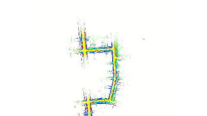
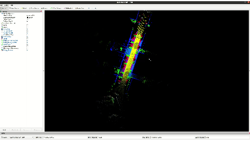

# Semantic-LIO-SAM

Semantic-LIO-SAM is a semantic-aware LiDAR-inertial SLAM system that integrates semantic cues into the full pipeline, including front-end registration, graph optimization, and loop closure detection.

<p align="center">
  
</p>

## Overview

Semantic-LIO-SAM extends a LiDAR-inertial SLAM pipeline with semantic information at three key stages:

- **Semantic front-end registration** improves scan-to-map alignment by incorporating semantic consistency during point cloud matching.
- **Semantic graph optimization** uses semantic confidence to modulate factor-graph constraints and improve global trajectory estimation.
- **Semantic loop closure detection** leverages semantic descriptors to retrieve loop candidates more reliably in large-scale scenes.

This design improves robustness in challenging environments with repeated structures, partial overlap, and appearance ambiguity.

## Paper

Our paper has been published in **IEEE Transactions on Circuits and Systems for Video Technology (IEEE TCSVT)**:

-[IEEE Xplore](https://ieeexplore.ieee.org/abstract/document/11361116)

If you find this work useful, please consider citing our paper.

## How To Run

### 1. Prepare semantic labels

The semantic segmentation results for LiDAR scans should be stored in a separate folder.  
You need to set the semantic label path in the YAML configuration file:

```yaml
semantic:
  label_folder: "/path/to/your/semantic_labels"
```

Please make sure that:

- the semantic labels preserve the exact frame order of the LiDAR scans,
- each label file corresponds to the correct LiDAR frame,
- the point-to-label association is not broken during data conversion.

### 2. Build the workspace

```bash
cd /home/pan/semantic-lio-sam
catkin_make
source devel/setup.bash
```

### 3. Launch Semantic-LIO-SAM

Choose the launch file and YAML configuration for your sensor setup. For example:

```bash
roslaunch semantic_lio_sam mapping_kitti.launch
```

Then play the rosbag:

```bash
rosbag play your_data.bag --clock
```

## SemanticKITTI Example

We provide a SemanticKITTI-oriented workflow for convenient evaluation.

### Convert SemanticKITTI to rosbag

We provide a Python script:

- `kitti2bag_order_ivox.py`

This script converts SemanticKITTI data into rosbag format **without breaking the correspondence between point clouds and semantic labels**.

Example usage:

```bash
python3 kitti2bag_order_ivox.py
```

Please edit the paths inside the script or adapt it to your local SemanticKITTI directory before running.

### Example dataset

You can also use our provided example dataset:

- Baidu Netdisk: https://pan.baidu.com/s/1R5eOx2-C73m9jblwoQyFhA
- Extraction code: `ubkk`

### Example result

<p align="center">
  
</p>

## Notes

- The semantic label folder must be configured correctly in the YAML file before running.
- The semantic labels must remain aligned with the LiDAR point cloud order.
- For best performance, make sure LiDAR and IMU timestamps are properly synchronized.

## Acknowledgment

This project builds upon LiDAR-inertial SLAM and semantic perception components from the open-source community. We thank the authors of FAST-LIO, LIO-SAM, ikd-Tree, and related semantic point cloud processing projects for their inspiring work.
